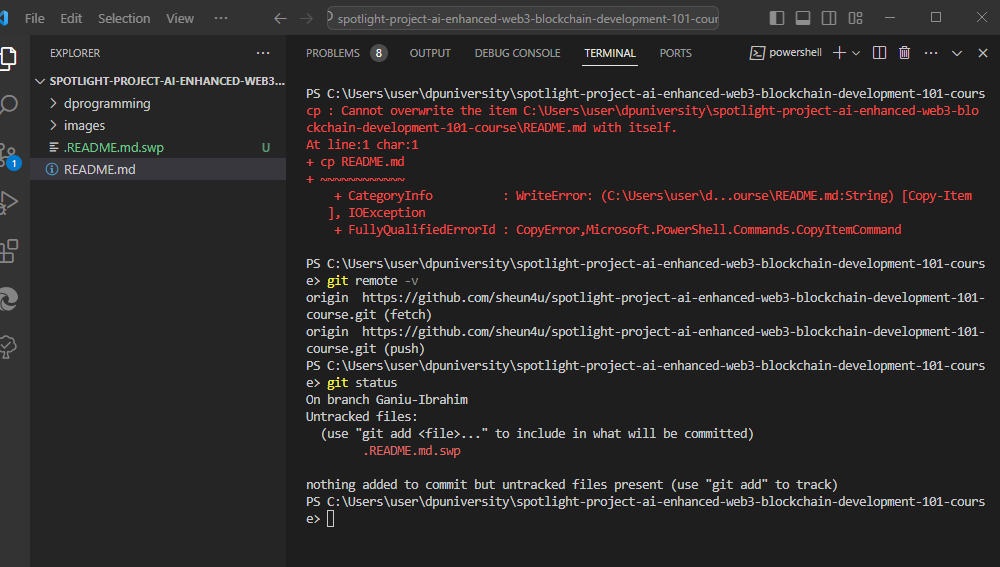

# Spotlight Project For AI-Enhanced Web3/Blockchain Development 101 Course

Welcome to the Spotlight Project for the AI-Enhanced Web3/Blockchain Development 101 Course at dProgramming University. Follow the instructions below to complete your project submission.

## Project Instructions:

1. Star and fork this repository.
2. Clone your forked repository to your local machine.
3. Create and switch to a new branch named after your certificate name.
4. Answer the questions provided in each section summary.
5. Take a screenshot of your terminal after running `git remote -v` and `git status`.
6. Push your changes and open a pull request to merge your branch into the main branch of this repository.

## Section Summaries:

### SECTION 1: THE WEB3 REVOLUTION

**Exploring the Web3 Revolution: The New Decentralized Internet**

-   Response:

I learn about how Web3 envolved from Web1 to Web3 and the decentralization it brought.

**Unlocking the Potential of Blockchain Technology**

-   Response:

In this lesson, I learnt alot about Blockchain technology like nodes, validator, consensor to prepare me as a Blockchain developer.

### SECTION 2: SMART CONTRACTS UNVEILED

**Smart Contracts Explained: The Building Blocks of Web3**

-   Response:
    I learnt about smart contract

### SECTION 3: DIVE INTO BLOCKCHAIN PLATFORMS

**Bitcoin Blockchain: The Origin and Evolution of the First Cryptocurrency**

-   Response: learnt about evolution of money, and digital currencies.

**Ethereum Ecosystem: A Deep Dive into EVM Blockchains**

-   Response:
    learnt about smart contract solidity for ethereum which is compactible with othe evm blockchains

**Solana Ecosystem: The High-Speed Blockchain Network**

-   Response:
    I Learnt about solana blockchain and how to navigate the ecosystem as a developer

### SECTION 4: DECODING DAPPS

**dApps Decoded: Unpacking Decentralized Applications**

-   Response:
    learnt about dApps and how developers are trying to solve interoperability among different dApps

### SECTION 5: TOP WEB3 PROGRAMMING LANGUAGES

**Vanilla Solidity: Smart Contract Language of Ethereum/EVM Smart Contracts**

-   Response:
    Learnt introduction to solidy language, hoping to get there very soon

**Solang Solidity for Solana: Adapting Solidity for Non-EVM Blockchains**

-   Response:
    Solang for solana ecosystem, I was also introduced to the language and hoping to learn more

### SECTION 6: SETUP WEB3 DEVELOPMENT ENVIRONMENT

**Web3 Developer Toolbox: Setting up Web3 Development Environment (Ethereum/Solana)**

-   Response:
    Setting up the environment was a bit a challenge for me, but glad I could get it done

### SECTION 7: GIT & GITHUB FOR WEB3 DEVELOPMENT COLLABORATION

**Introduction To Git & GitHub for Web3 Development**

-   Response:
    Git is very interactive, and it is cool for collaborations.

### SECTION 8: AI TOOLS FOR WEB3 DEVELOPMENT

**Introduction To AI Tools For Web3 Development**

-   Response:
    Got a glimpse of AI tools for web3 development, it was an interesting section

### SECTION 9: COURSE PROJECT

**Spotlight Project For AI-Enhanced Web3/Blockchain Development 101 Course**

-   Response: The project was indeed helpful, I had to practices all I have learned.

## Screenshot Submission:

Upload your terminal screenshots here to show that you have followed the GitHub steps correctly.

Make sure the URL of the remote in your screenshot matches the URL of your GitHub repo for this project.

## Conclusion:

Remember, to earn your certificate, you must complete this project satisfactorily. Your submission will be reviewed, and you will receive feedback accordingly. Good luck!

Solomon Foskaay

Founder,

[dProgramming University](https://dProgrammingUniversity.com)
