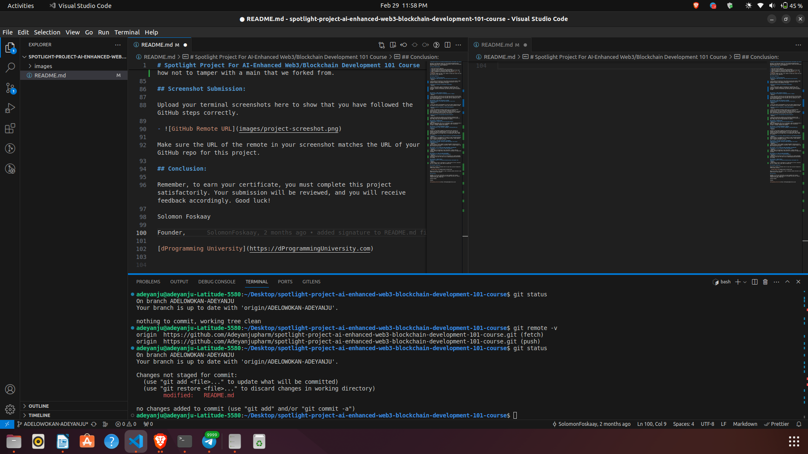

# Spotlight Project For AI-Enhanced Web3/Blockchain Development 101 Course

Welcome to the Spotlight Project for the AI-Enhanced Web3/Blockchain Development 101 Course at dProgramming University. Follow the instructions below to complete your project submission.

## Project Instructions:

1. Star and fork this repository.
2. Clone your forked repository to your local machine.
3. Create and switch to a new branch named after your certificate name.
4. Answer the questions provided in each section summary.
5. Take a screenshot of your terminal after running `git remote -v` and `git status`.
6. Push your changes and open a pull request to merge your branch into the main branch of this repository.

## Section Summaries:

### SECTION 1: THE WEB3 REVOLUTION
**Exploring the Web3 Revolution: The New Decentralized Internet**
- Response: 

I learnt about the evolution of the internet from the basic Web1 to Web3 which gives power to the people through decentralization, the core concepts of web3 and the potential it brings.

**Unlocking the Potential of Blockchain Technology**
- Response: 

I learnt about blocks, types of blockchain by accessibility, smart contracts, consensus mechanism on blockchains, types of tokens on the blockchain, security in blockchain, gas fees and the types of developers in web3.

### SECTION 2: SMART CONTRACTS UNVEILED
**Smart Contracts Explained: The Building Blocks of Web3**
- Response: 

I learnt that smart contracts are self-executing contracts with the terms of the agreement directly written into code. They are secure and cannot be altered once deployed and are only executed when the conditions in the smart contract code are met.

### SECTION 3: DIVE INTO BLOCKCHAIN PLATFORMS
**Bitcoin Blockchain: The Origin and Evolution of the First Cryptocurrency**
- Response: 

I learnt that about the development of the first known cryptocurrency and the freedom from centralization. I learnt that bitcoin operates on UTXO

**Ethereum Ecosystem: A Deep Dive into EVM Blockchains**
- Response: 

I learnt that Ethereum blockchain wasthe first to incorporate smart contracts and this led to it being the foundational layer for decentralization. The ethereum blockchain started with proof of work and later transitioned to proof of stake. I also learnt about the problems that came with ethereum blockchain and the solutions.

**Solana Ecosystem: The High-Speed Blockchain Network**
- Response: 

I learnt that solana was created as an alternative solution to the challenges faced with ethereum blockchain with speed and efficiency in mind. Solana uses proof of stake and proof of history.

### SECTION 4: DECODING DAPPS
**dApps Decoded: Unpacking Decentralized Applications**
- Response: 
dApps are applications that run on a blockchain. They are decentralized so they offer enchanced security and transparency. Their architecture includes a frontend, middlware and backend.

### SECTION 5: TOP WEB3 PROGRAMMING LANGUAGES
**Vanilla Solidity: Smart Contract Language of Ethereum/EVM Smart Contracts**
- Response: 

Solidity is the primary language for developing smart contracts on ethereum and other evm based blockchain. It is also called vanilla solidity to be able to differentiate it from solang. Remix IDE, truffle Suite and Hardhat are the common tools for writing smart contract codes for solidity.

**Solang Solidity for Solana: Adapting Solidity for Non-EVM Blockchains**
- Response: 
Solang solidity is an adaptation of solidity to other non_EVM blockchains, solana inclusive. Development tools for Solang include: solang compiler, anchor framework and Solana tool suite.

### SECTION 6: SETUP WEB3 DEVELOPMENT ENVIRONMENT
**Web3 Developer Toolbox: Setting up Web3 Development Environment (Ethereum/Solana)**
- Response: 
I learnt about the tools needed for web3 development starting with the operating system, the terminal, git/github, node.js, package managers and how to install these tools.

### SECTION 7: GIT & GITHUB FOR WEB3 DEVELOPMENT COLLABORATION
**Introduction To Git & GitHub for Web3 Development**
- Response: 
I learnt about the importance of git and github. I learnt some git commands and how to apply them. And also how to contribute to repositories on github.

### SECTION 8: AI TOOLS FOR WEB3 DEVELOPMENT
**Introduction To AI Tools For Web3 Development**
- Response: 
I learnt about the various AI tools at the disposal of a web3 programmer, advantages of one over the other, how to choose appropriate ones and how to use them. 

### SECTION 9: COURSE PROJECT
**Spotlight Project For AI-Enhanced Web3/Blockchain Development 101 Course**
- Response: 
I learnt hands on how to contribute to a repo and how to fork a repo and how not to tamper with a main that we forked from.

## Screenshot Submission:

Upload your terminal screenshots here to show that you have followed the GitHub steps correctly.

- 

Make sure the URL of the remote in your screenshot matches the URL of your GitHub repo for this project.

## Conclusion:

Remember, to earn your certificate, you must complete this project satisfactorily. Your submission will be reviewed, and you will receive feedback accordingly. Good luck!

Solomon Foskaay

Founder,

[dProgramming University](https://dProgrammingUniversity.com)

