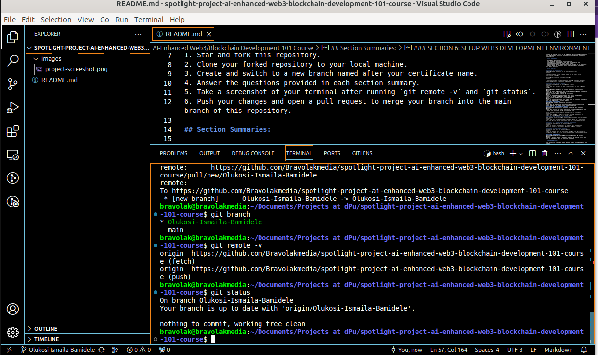

# Spotlight Project For AI-Enhanced Web3/Blockchain Development 101 Course

Welcome to the Spotlight Project for the AI-Enhanced Web3/Blockchain Development 101 Course at dProgramming University. Follow the instructions below to complete your project submission.

## Project Instructions:

1. Star and fork this repository.
2. Clone your forked repository to your local machine.
3. Create and switch to a new branch named after your certificate name.
4. Answer the questions provided in each section summary.
5. Take a screenshot of your terminal after running `git remote -v` and `git status`.
6. Push your changes and open a pull request to merge your branch into the main branch of this repository.

## Section Summaries:

### SECTION 1: THE WEB3 REVOLUTION
**Exploring the Web3 Revolution: The New Decentralized Internet**
- Response: 

I learn about how Web3 evolved from Web1 to web2 and Web3 as well as the decentralization it brought.

**Unlocking the Potential of Blockchain Technology**
- Response: 

In this lesson, I learnt alot about Blockchain technology like nodes, validator, consensor and potentials of blockchain to prepare me as a Blockchain developer.

### SECTION 2: SMART CONTRACTS UNVEILED
**Smart Contracts Explained: The Building Blocks of Web3**
- Response: 
I learnt about smart contract, the types of smart contracts and their programming languages.

### SECTION 3: DIVE INTO BLOCKCHAIN PLATFORMS
**Bitcoin Blockchain: The Origin and Evolution of the First Cryptocurrency**
- Response: 
I learnt the genesis of Bitcoin as being introduced by Satoshi Nakamoto as the first cryptocurrency and how it is decentralized.
**Ethereum Ecosystem: A Deep Dive into EVM Blockchains**
- Response: 
I learnt how ethereum brought the concept of smart contract into blockchain technology and changed from Proof of Work to Proof of Stake.
**Solana Ecosystem: The High-Speed Blockchain Network**
- Response: 
I learnt how Solana was built with focus on high speed, low transaction cost and its use of Proof of History as a concensus mechanism.
### SECTION 4: DECODING DAPPS
**dApps Decoded: Unpacking Decentralized Applications**
- Response: 
I learnt about the decentralized Applications (dApps), their architectures like frontend, middleware and backend as well as their significance.
### SECTION 5: TOP WEB3 PROGRAMMING LANGUAGES
**Vanilla Solidity: Smart Contract Language of Ethereum/EVM Smart Contracts**
- Response: 
I learnt about Solidity, its history, applications, challenges and how Solang makes it easy to bring Solidity to non-EVM blockchain like Solana.

**Solang Solidity for Solana: Adapting Solidity for Non-EVM Blockchains**
- Response: 
I learnt about Solang as a compiler for Solidity that helps developers to use Solidity for creating dApps on non-EVM such as Solana.
### SECTION 6: SETUP WEB3 DEVELOPMENT ENVIRONMENT
**Web3 Developer Toolbox: Setting up Web3 Development Environment (Ethereum/Solana)**
- Response: 
I learnt about tools that are necessary for building dApps on web 3 like linux or ubuntu linux operating system, visual studio code, node J.S, Git and Github, etc.

### SECTION 7: GIT & GITHUB FOR WEB3 DEVELOPMENT COLLABORATION
**Introduction To Git & GitHub for Web3 Development**
- Response: 
I learnt how to create Github account, git commands, how to fork and clone repositories in order to contribute to open source using best practices.

### SECTION 8: AI TOOLS FOR WEB3 DEVELOPMENT
**Introduction To AI Tools For Web3 Development**
- Response: 
I learnt how to use AI tools for assistance in coding and other operations during development of dApp in web 3. This will seriously increased productivity and reduced time taken.

### SECTION 9: COURSE PROJECT
**Spotlight Project For AI-Enhanced Web3/Blockchain Development 101 Course**
- Response: 
I put what I learnt in section 7 to practice by forking the spotlight project repo, cloned it, made a branch of it and contributed to the repo.

## Screenshot Submission:

Upload your terminal screenshots here to show that you have followed the GitHub steps correctly.

- 

Make sure the URL of the remote in your screenshot matches the URL of your GitHub repo for this project.

## Conclusion:

Remember, to earn your certificate, you must complete this project satisfactorily. Your submission will be reviewed, and you will receive feedback accordingly. Good luck!

Solomon Foskaay

Founder,

[dProgramming University](https://dProgrammingUniversity.com)

